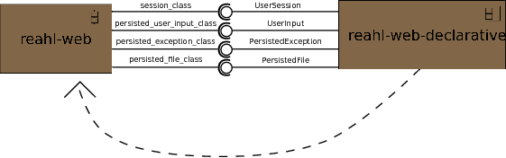

.. Copyright 2013, 2014, 2016 Reahl Software Services (Pty) Ltd. All rights reserved.
 
Using a different persistence mechanism
=======================================

The Reahl framework itself contains a few classes that need to be
persisted to a database. For example, the
:class:`~reahl.webdeclarative.webdeclarative.UserSession` implements
:doc:`session functionality <../tutorial/sessions>`. There is a handful of other
classes that work in concert with the
:class:`~reahl.webdeclarative.webdeclarative.UserSession`.

These persisted classes are written using a specific object
persistence technology. The technology used throughout this tutorial
is SqlAlchemy (using Declarative). Rather than tie the Reahl framework to
a specific persistence technology, the (small) part of the Reahl
framework that is written using Declarative/SqlAlchemy is split into a
separate component. This component can be swapped out for a different
one which contains an implementation that uses a persistence technology
of your choosing.

The Reahl framework itself is agnostic towards the persistence
technology used -- it needs to be supplied with a few classes, each of
which sports a given interface. The framework makes use of a simple
form of `dependency injection
<http://www.martinfowler.com/articles/injection.html>`_ in order to
discover which implementation of these classes which it should use for a
given application. This section aims to tell you a little more about
the role dependencies play in Reahl in general, and how to use
dependency injection. It does to at the hand of the example of writing
your own implementation of the persisted classes needed by the
framework itself, but the mechanism is meant to be used for other
means in your application as well.

Dependencies
------------

Right at the beginning of the tutorial, in the :doc:`../tutorial/gettingstarted-develop`, we
state that all code in a Reahl program is packaged into :doc:`some or
other component <../component/introduction>`. This component is packaged as a Python Egg. When you
write your web application, you write it as such an Egg. As it goes
with Eggs, if you want one Egg to use the code in another Egg, the
first Egg must declare its dependence on the other one which it is
using.

Your web application itself is such a component/Egg, and it uses a
number of other components -- such as the ones that contain the Reahl
web framework itself, or other third party components. In fact, you
can visualise your application as a component that sits at the root of
a whole dependency graph of components.

Part of the configuration of an application actually specifies what
this "root egg" of your project is. You have not seen it mentioned in
this tutorial, because it is defaulted to the name of the directory in
which your component is developed (that is also what is used as the
default for the name of your component). This default works fine for
the examples presented while in a development environment. In a
production environment, the proper *root egg* of the web application
has to be set explicitly via the `reahlsystem.root_egg` setting in the
`reahl.config.py` file.

The information gleaned from this dependency graph is very important
for the implementation of many aspects of Reahl. Take configuration,
for example: each individual component has its own configuration. If
component A is dependent on component B, it makes sense to first read
the configuration of component B before you read the configuration of
component A (which may use B, and thus expect B to be
configured!). Similarly, if component A is dependent on component B,
the database schema of persisted classes in component A may be
dependent on the schema of those in component B. When you create a
schema for an entire application, you'd have to first create the
schema for the components that are leaf nodes in this dependency tree
and work your way towards the root. Database :class:`~reahl.component.migration.Migration`\ s are also run
in a special order: you want to first change the schema of the
components at the leaves of this dependency tree, followed by the
components that depend on them, etc -- until you reach the root, which
is most impacted by all these changes. The `cleanup` phase of
migration is run in the reverse order.

All these complications are of course necessary to be able to develop
components that do not contain any knowledge of the circumstances of
where they will be used. This is the cornerstone (and price) of being
able to make reusable components.

.. _dependency_injection:

Dependency injection
--------------------

As explained at the beginning of this section, the `reahl-web`
component needs a number of classes that are provided by a different
component. The Declarative-based implementation of these classes live in
the `reahl-web-declarative` component. Diagrammatically this is the scenario:

Normally, `reahl-web` would merely import the classes it needs from
`reahl-web-declarative`, but that would make `reahl-web` dependent on
`reahl-web-declarative` without any possibility to swap
`reahl-web-declarative` out for a different implementation. So,
instead, the `reahl-web` component discovers the actual classes it
should use during run-time, when an application starts up. The
mechanism used to do this is simply the configuration of `reahl-web`:
The configuration for `reahl-web` takes, amongst other settings:

=============================      ======================================
   Configuration setting                        Description
=============================      ======================================
web.persisted_exception_class      The class used for PersistedExceptions
web.persisted_file_class           The class used for PersistedFiles
web.persisted_userinput_class      The class used for UserInput
web.session_class                  The class used for UserSessions
=============================      ======================================

The `reahl-web` component could thus simply read its config file
(`web.config.py`), in which the correct classes to be used are
imported and assigned to the settings as listed above. This plan will
work, but, it is a bit cumbersome. Besides, do you really want the one
writing those config files to deal with such low-level implementation
details?

Instead, there's a bit of a twist to the configuration mechanism to
make it usable for this purpose without the need for users to write
anything in a configuration file: One component can set parts of the
configuration of another. Hence, the `reahl-web-declarative` component
itself modifies the configuration of `reahl-web` to supply these
special settings -- without any need for a user to configure anything.

A :class:`~reahl.component.config.Configuration` class can optionally have a method
`.do_injections()`. This method is called after that configuration has
been read. When called, it is passed the entire configuration of the
system. The programmer of `reahl-web-declarative` can thus write code
in this method to supply or change the configuration of any component
that has been read by this time. To ensure that the configuration of
`reahl-web` is read before that of `reahl-web-declarative`,
`reahl-web-declarative` is declared to be dependent on `reahl-web` in
its `setup.cfg` file (an **inverted dependency**).

Here is the :class:`~reahl.component.config.Configuration` of the
`reahl-web-declarative` component:

.. literalinclude:: ../../../reahl-web-declarative/reahl/webdeclarative/webdeclarative.py
   :pyobject: WebDeclarativeConfig

(The classes assigned here are defined higher up in the same file.)

One caveat remains: the configuration of each component is checked and
verified as soon as it has been read, but *before* the configuration
for the next component is read. If any required setting has not been
supplied by this point an error will be raised. Settings that are
meant to be injected are still missing by the time they are validated
because they are meant to be automatically supplied later, by another
component. For this reason such an "injected" :class:`~reahl.component.config.ConfigSetting` must be
declared with the `automatic=True` keyword argument when created. This
serves as a marker for the configuration system to allow them to be
set only later on.

