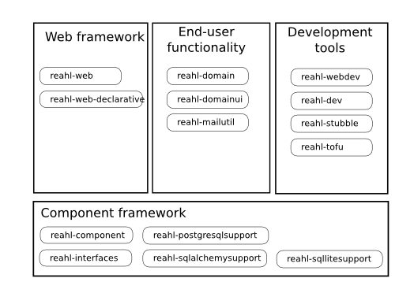

.. Copyright 2013, 2014 Reahl Software Services (Pty) Ltd. All rights reserved.
 
Documentation overview
======================

Introduction
------------

Reahl comprises several different sets of components that can be used
independently of one another:

.. seealso:: 

   For a web-centric introduction to all the components used:
   
   - The :doc:`Getting started guide <tutorial/gettingstarted-install>`.
   - The :doc:`web application tutorial <tutorial/index>`.
   - The :doc:`programmer's guide <devmanual/index>`.
  

Component framework
~~~~~~~~~~~~~~~~~~~

The component framework contains the infrastructure that enables
Reahl's brand of component-based development. It also allows a
programmer to build domain models that are annotated with information
used by user interface code.

The core of the Reahl component framework is implemented in
`reahl-component`. Support for different databases or ORM tools is
implemented in separate components: `reahl-postgresqlsupport`,
`reahl-sqlalchemysupport`, `reahl-sqllitesupport` and `reahl-mysqlsupport`.

All of these components are introduced under the heading of
:doc:`component/introduction`.

Web framework
~~~~~~~~~~~~~

The web framework provides the tools for developing applications with
web-based user interfaces.

The core of the web framework is written such that it is independent
of the technology used for object persistence. This core is in the
`reahl-web` component. The web framework does use some objects that
are persisted though -- an implementation of these using SqlAlchemy's 
declarative is provided in `reahl-web-declarative`.

These components are introduced in the :doc:`web application tutorial <tutorial/index>`.

End-user functionality
~~~~~~~~~~~~~~~~~~~~~~

The end-user functionality included in the distribution of Reahl is
split into two components: `reahl-domain` and `reahl-domainui`.

The `reahl-domain` component contains the domain models and logic,
whereas `reahl-domainui` provides the related web user interfaces.

Simple support for sending emails is provided by `reahl-mailutil`.

All these are also introduced in the :doc:`web application tutorial <tutorial/index>`.

Browser tools
~~~~~~~~~~~~~

`reahl-browsertools` is an abstracted interface to WebDriver including
a programmatic way of composing XPaths. See :doc:`its documentation
for more detail <browsertools/introduction>`.

Tofu
~~~~

The `reahl-tofu` component contains our test Fixture framework and
extensions that bolt it onto `pytest <https://pytest.org/>`_. It also
contains a small collection of other test utilities. See :doc:`its documentation
for more detail <tofu/introduction>`.

Stubble
~~~~~~~

Stubble (in `reahl-stubble`) enables one to write stub classes that
will break if the interfaces of the classes they stub should change. See :doc:`its documentation
for more detail <stubble/introduction>`.

Other tools
~~~~~~~~~~~

We do all development :doc:`inside a docker image
<devmanual/devenv>`. The `reahl-workstation` component is meant to
be installed on your main workstation. It contains a stripped-down
version of the `reahl` command containing commands that help deal with
whats inside the docker image.

Infrastructure is provided in `reahl-dev` and `reahl-webdev` for
dealing with Reahl components using an extensible command line
tool. This includes a web server for development purposes and a number
of special tofu Fixtures that are useful when developing Reahl.

The development tools are introduced in :doc:`devtools/introduction`.

  

API Reference
-------------

- :doc:`reahl-component <component/index>`: Infrastructure for component-based development.
- :doc:`reahl-web <web/index>`: The Reahl web framework.
- :doc:`reahl-domain <domain/index>`: Domain functionality for use with the web framework.
- :doc:`reahl-browsertools <browsertools/index>`: Composable XPaths and an interface to WebDriver.
- :doc:`reahl-tofu <tofu/index>`: Class-based Fixtures and other testing tools.
- :doc:`reahl-stubble <stubble/index>`: Stub classes that break tests if they are out of sync with the real class.
- :doc:`Other tools <devtools/index>`: Other development tools.

