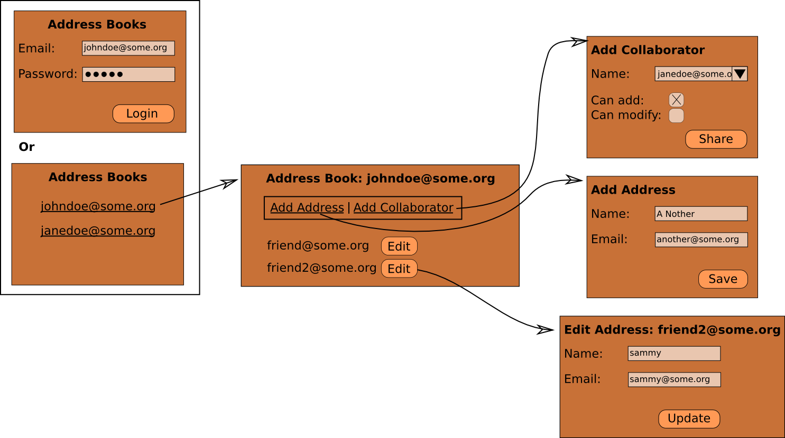

.. Copyright 2013, 2016 Reahl Software Services (Pty) Ltd. All rights reserved.

.. |Field| replace:: :class:`~reahl.component.modelinterface.Field`
.. |Event| replace:: :class:`~reahl.component.modelinterface.Event`
.. |Action| replace:: :class:`~reahl.component.modelinterface.Action`
.. |UrlBoundView| replace:: :class:`~reahl.web.fw.UrlBoundView`
.. |Widget| replace:: :class:`~reahl.web.fw.Widget`
.. |Input| replace:: :class:`~reahl.web.ui.Input`
.. |Button| replace:: :class:`~reahl.web.bootstrap.forms.Button`
.. |Nav| replace:: :class:`~reahl.web.bootstrap.navs.Nav`

                            
Security and access control
===========================

.. sidebar:: Examples in this section

   - tutorial.accessbootstrap

   Get a copy of an example by running:

   .. code-block:: bash

      reahl example <examplename>

Multi user address book
-----------------------

The example in this section is a multi-user address book
application. Each user has his or her own address book. Users can also
grant other users (called collaborators) the rights to see, change or
add to the address books of one another.

Here's how you can navigate the application:

   A schematic plan of the user interface

Access control rules
--------------------

* By default, no-one can see another's address book.
* Only the owner of an address book can add others as collaborators to her own address book or change their collaborating rights.
* If user A adds user B as collaborator (with NO rights), user B can see the address book of A but cannot change anything.
* If user A gives collaborator B "can modify" rights, B can only edit the existing email addresses in A's address book, but cannot edit the names those addresses belong to.
* If user A gives collaborator B "can add" rights, B can add addresses to A's address book and modify any field of existing addresses.

.. sidebar:: Running the example

   To play with the `tutorial.accessbootstrap` example, create 
   sample data with: `reahl demosetup`. 

   All users created have the password "topsecret". The one user 
   (johndoe@some.org) has various levels of access to the address 
   books of others.

   The details are in 
   `accessbootstrap_dev/test_accessbootstrap.py::demo_setup` in 
   the example.
   

User interface requirements
---------------------------

In order to ensure these rules are adhered to, there are lots of things to look out for on the user interface:

* Where addresses are edited or added, you need to make sure that its "email_address" and "name" |Field|\s are editable or grayed out or not shown at all, depending on the rules.

* The "Edit" button next to each email address must be grayed out unless the user is allowed to edit that Address.

* The "Add collaborator" and "Add address" menu items must be grayed out if the user is not allowed to perform the specific function on the current address book.

* If a malicious user figures out what URL to type in order to visit a |UrlBoundView| for something she is not allowed to visit (ie, someone else's address book), that page should not be displayed.

Protect the fields on Address
-----------------------------

Pass an |Action| (which returns a boolean) as a `readable` or `writable`
keyword argument to the |Field|\s assigned in Address.fields in order
to control the access granted by any |Input| that displays that
|Field|\.

- If a |Field| is readable, but not writable, an |Input| using it
  will be present, but greyed out.

- If the |Field| is both readable and writable, the |Input| will be
  displayed and active.

- If the |Field| is not readable and also not writable, the
  corresponding |Input| will not be displayed on the page at all.

- It is also possible for some |Field|\ s to be writable, but yet not
  readable (as used for passwords---that may be written but not
  read). In this case, an |Input| would be displayed and be active,
  but it will always be rendered without any contents.

Here it is in the code of Address:

.. literalinclude:: ../../reahl/doc/examples/tutorial/accessbootstrap/accessbootstrap.py
   :start-at: fields = 
   :end-at: fields.email_address = 

The `name` |Field| is required, but that only applies when it is writable.

The methods used by the |Action|\s:

.. literalinclude:: ../../reahl/doc/examples/tutorial/accessbootstrap/accessbootstrap.py
   :pyobject: Address.can_be_added

.. literalinclude:: ../../reahl/doc/examples/tutorial/accessbootstrap/accessbootstrap.py
   :pyobject: Address.can_be_edited

Protect the "Edit" button
-------------------------

The same principle applies to the `edit` |Event| of an
Address, and the |Button| for it:

.. literalinclude:: ../../reahl/doc/examples/tutorial/accessbootstrap/accessbootstrap.py
   :start-at: events = 
   :end-at: events.edit = 

Disable menu items as necessary
-------------------------------

Specify access control on each |UrlBoundView| by setting its
:attr:`~reahl.web.fw.UrlBoundView.read_check` or
:attr:`~reahl.web.fw.UrlBoundView.write_check` to a callable that
returns True only if the user is granted the relevant right.

An item on a menu (|Nav|) is a link to another |UrlBoundView|. It is
automatically disabled (or not shown at all) depending on the access
of its target |UrlBoundView|.

For example, for EditAddressView:

.. literalinclude:: ../../reahl/doc/examples/tutorial/accessbootstrap/accessbootstrap.py
   :pyobject: EditAddressView

Protect URLs from malicious users
---------------------------------

What if a malicious user discover what the URL is for an addresses she
is not allowed to see?

Since EditAddressView is already aware of access rights (as per the
previous section), visiting that URL will result in an HTTP 403 error
if the user does not qualify to see it.

Out of sight
------------

Reahl safeguards against many potential ways that malicious attackers
could try to bypass your restrictions.

A malicious user could edit the HTML in the browser to enable inputs
that were originally disabled. However, the same access control rules
that generate that HTML is again checked server side when input is
received to ensure this cannot happen.

A malicious user can also snoop on network traffic to the browser and
see sensitive information, such as a password. To guard against this,
a |Widget| can be made "security sensitive". If any security sensitive
|Widget| is detected on an |UrlBoundView|, that |UrlBoundView| is
automatically served via HTTPs.

Any |Widget| that has a non-default `read_check` is deemed security
sensitive. Alternatively, call
:meth:`~reahl.web.fw.Widget.set_as_security_sensitive` explicitly.

In the case of :class:`~reahl.web.ui.Input`
:class:`~reahl.web.fw.Widget`\ s, the same inference is made from the
access rights of the :class:`~reahl.component.modelinterface.Field` to
which it is linked.

