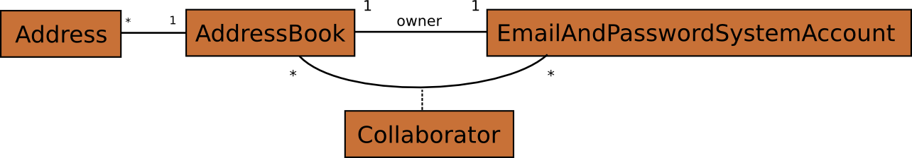

.. Copyright 2013 Reahl Software Services (Pty) Ltd. All rights reserved.
 
Security and access control
===========================

.. toctree::
   :hidden:

   accesscontrolinc1
   accesscontrolinc2
   accesscontrolinc3
   accesscontrolinc4

.. sidebar:: Examples in this section

   - tutorial.access1
   - tutorial.access2
   - tutorial.access

   Get a copy of an example by running:

   .. code-block:: bash

      reahl example <examplename>

In most useful applications different users are allowed to do
different things, depending on rules that form part of the underlying
model. Implementing such access control complicates even simple
applications, and the smallest mistake can be a big deal.

To try and mitigate this problem, Reahl makes it possible for a
programmer to state the access to various different user interface
elements and elements of a model. Using this information, the
framework selectively greys out elements, completely hides others or
outright refuses requests to resources that are off-limits.

Some security features are also needed to prevent malicious users with
enough technical knowledge to circumvent such rules that have been put
in place.

An example model
----------------

In order to show these access control features at work, a more
involved example is needed. Our example application is an extension of
the address book application used before. To spice it up, users now
have to log into the application, and each user has a separate address
book. Of course, one user is not allowed to see the address book of
another.

Users can share their own address book with other users though -- let's
call these other users the collaborators to the shared
AddressBook. When sharing your address book with another user, you
specify what rights the other users have to your address book. There
are three possibilities:

- If someone can collaborate, but has no special rights, that someone
  is merely allowed to see addresses in your address book, but not
  allowed to change anything; or
- Someone can collaborate and be granted the right to edit existing
  addresses in your address book; or
- Someone who collaborates can be granted the right to add new
  addresses to your address book.

There is one final rule: if you're only allowed to edit (not add)
addresses in someone else's address book, you'll be able to change the
email address part, but not the actual name of the person it belongs
to.

Here is a little model implementing the basic concepts of the
application. To keep things simple, a user is represented by an
EmailAndPasswordSystemAccount -- something that's already built, and
can be re-used.

   A model for users with address books

.. note:: 

   The way the Collaborator relationhip is modelled here in `UML
   <http://en.wikipedia.org/wiki/Unified_Modeling_Language>`_, is
   interesting. To just indicate that an AddressBook has
   Collaborators, the line representing the relationship would
   suffice. In this case, that line is also modelled as a class in its
   own right because each relationship has to hold some more info: the
   rights a particular EmailAndPasswordSystemAccount has to the
   particular AddressBook for a particular instance of the
   relationship.

An example user interface
-------------------------

The user interface works as follows: the home page looks different,
depending on whether you are logged in or not. To users that are not
logged in, it presents a way to log in. Once logged in, it changes to
show a list of address books you are allowed to view. Each address
book listed also links to a page where you can see the contents of the
address book.

Once on the page of an address book, there is a menu from which you
can choose to add an address or add a collaborator. Each address in
the address book has an edit button as before.

.. figure:: accessapp.png
   :align: center
   :width: 90%

   A schematic plan of the user interface

The schematic of the user interface above includes everything any user
could possibly do with the application. That is how applications are
planned and built. Access control for an individual user will just
have the effect that some elements would be missing for that user, or
greyed out.

For example: if you are on someone else's address book you can't see
the "Add Collaborator" item in the :class:`~reahl.web.ui.Menu` at all. For a variation on the
theme, the "Add Address" item is always visible, but is disabled
unless you are allowed to add addresses in the address book
viewed. The same goes for the "Edit" :class:`~reahl.web.ui.Button` next to each address -- it
is always there, but greyed out unless you are allowed to add
addresses in the address book viewed. When editing an address, the
:class:`~reahl.web.ui.Input` for "Name" is only editable if you are allowed to add addresses
to the address book.

Even if you've taken care to implement all the above, a malicious user
can quite easily figure out how to manually type an URL to, for
example view an address book that they are not allowed to see. If this
happens, the server responds with `an error indicating to the browser
that the user is not allowed access to the entire View
<http://en.wikipedia.org/wiki/HTTP_403>`_.

Another possible place where an attacker could try to break in is
right at the start when the user has to log in to the
application. Since the user has to type a password, that password will
be sent back to the server and could be seen by a malicious party
scanning the traffic between the server and the browser.  Reahl
automatically detects this potential problem, and serves the home page
via an encrypted connection.

Implementing the application
----------------------------

This is not a trivial example. Its code touches on quite a number of
topics. We will proceed to build the application in
increments -- please familiarise yourself with the code as we go
along. That way, it is easier to focus your attention on the bits that
form part of the topic of this section.

- :doc:`The first step is to build some basic parts of the model
  <accesscontrolinc1>`. 

- :doc:`Next, we build all the functionality of the user interface, but
  without any access control <accesscontrolinc2>`. 
  There is quite a number of things to understand just in this code
  (which is not even about access control). So lets get it out of the
  way in order to focus on the real topic of this chapter.

- :doc:`The last step is to add all the access control bits <accesscontrolinc3>`. 
  Seen on its own like this, it is quite easy.

Before we can move on completely, it is good to know a bit more about
:doc:`the underlying mechanisms that safeguard the security of the
access control mechanisms now put in place <accesscontrolinc4>`.
