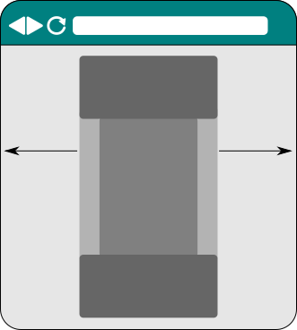
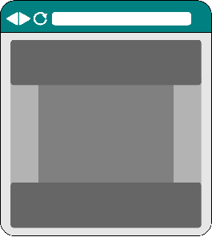

.. Copyright 2016 Reahl Software Services (Pty) Ltd. All rights reserved.

.. |ColumnLayout| replace:: :class:`~reahl.web.bootstrap.grid.ColumnLayout`
.. |Div| replace:: :class:`~reahl.web.bootstrap.ui.Div`
.. |HTMLElement| replace:: :class:`~reahl.web.ui.HTMLElement`
.. |ResponsiveSize| replace:: :class:`~reahl.web.bootstrap.grid.ResponsiveSize`
.. |Container| replace:: :class:`~reahl.web.bootstrap.grid.Container`
.. |Widget| replace:: :class:`~reahl.web.fw.Widget`

Layout of pages
===============

.. sidebar:: Examples in this section

   - tutorial.bootstrapgrids

   Get a copy of an example by running:

   .. code-block:: bash

      reahl example <examplename>

The :mod:`reahl.web.bootstrap.grid` module provides tools with which
you can control the basic layout of a page. Layout is responsive,
meaning that it adapts depending on the size of the device used to
view the page.

The basic tools for laying out a page are
:class:`reahl.web.bootstrap.grid.Container`,
:class:`reahl.web.bootstrap.grid.ColumnLayout` and
:class:`reahl.web.bootstrap.grid.ResponsiveSize`.

Containers
----------

Some web sites present all their contents in an area of fixed size,
with the entire "content area" itself centered on the browser viewport.

On other sites, the contents of the site span the entire width of the
viewport instead:

A |Container| manages the layout of an |HTMLElement| and its contents
to conform to one of these schemes.

A |Container| is by default "fixed", which means its contents will be
confined to a fixed-size area that is centered on the viewport. The
size of this fixed-size area does change if a browser is resized --
but it changes only at fixed intervals and stays centered on the
viewport.

When constructing a |Container| it can be set to be "fluid",
corresponding to the second example above where the contents of the
|HTMLElement| will fill the available width.

Different areas of a site may be laid out using different
|Container|\s. For example, you might want your pages to have, a
header and footer that both stretch the entire viewport width, but
with a content area inbetween that has a fixed width, and is centered.

Bootstrap requires that all Widgets laid out with a |ColumnLayout| be
nested somewhere (no matter how deeply) in another which is laid out
by a |Container|.

Responsive grids
----------------

A |ColumnLayout| is used to turn an |HTMLElement| such as a |Div| into
one row of an invisible grid with a number of columns inside that one
row. The |Widget|\s added as children to a particular column are then
positioned inside that (otherwise invisible) column.

When adding a column, you need to specify the size of that
column. This is done using a |ResponsiveSize|. A |ResponsiveSize| lets
you specify how wide the column should be on each possible size of
user device. User device sizes (called device classes) can be one of:

 - xs (extra small)
 - sm (small)
 - md (medium)
 - lg (large)
 - xl (extra large)

In the code below, 12 columns of 1/12th the page width are added to a
|Div|. Each column is a |Div| itself and all have the same text in
them. Note that the |ResponsiveSize| is only set up with a size for medium
devices. This means that the columns will be 1/12th of the page on
medium (or larger) devices. On devices smaller than medium, each column
will expand to the full width with all the columns stacked on top of
one another. (On small devices it is better to have to scroll down
further to see content than to have to scroll right).

.. literalinclude:: ../../../reahl/doc/examples/tutorial/bootstrapgrids/bootstrapgrids.py
   :pyobject: GridBasicsPage.add_twelve

A |ColumnLayout| can also be constructed with a list of tuples stating
what columns it should have and what each one should be called. In
this case, it will add all the specified columns (each a |Div| itself)
to the |Div| you apply it to and make these available as a
dictionary. An example is shown here:

.. literalinclude:: ../../../reahl/doc/examples/tutorial/bootstrapgrids/bootstrapgrids.py
   :pyobject: GridBasicsPage.add_two

In order to really appreciate the power of |ResponsiveSize|, you will
have to fire up the example and play around with it. The example here
includes different Views -- this View is the first called "Grid
basics".

Here is a screenshot of what the page looks like:

.. figure:: ../../_build/screenshots/bootstrapgrids.png
  :align: center
  :width: 70%
  :alt: A screenshot of the page.

See how the layout changes if you change the size of the window when
running the example yourself. On displays that are medium sized or
larger (with your browser maximised), you will see two rows: one with
12 equal sized columns, and another with two columns that are not
equally sized.

As soon as you make the browser window smaller than "md" size, things
change, however: All the columns now stack on top of one another and
fill the whole width of the screen to make them more usable on the
smaller sized screen.

Laying out a whole page
-----------------------

It is often useful to layout an entire page with a header area at the
top, a footer at the bottom, and a content area inbetween. The content
area is also often divided into different columns.

You can layout a page in this fashion by using
:class:`~reahl.web.bootstrap.grid.PageLayout` in conjunction with a
suitable |ColumnLayout| to be used for its content area.

The "Page layout" view in our example shows how this works:

.. literalinclude:: ../../../reahl/doc/examples/tutorial/bootstrapgrids/bootstrapgrids.py
   :pyobject: PageLayoutPage

Notice how the same responsive properties hold for such pages too --
go ahead and make your browser window smaller on this example.

You can nest the usage of a |ColumnLayout| inside others (like the
columns on this page), thereby creating complex grid structures that
resize on all levels.

