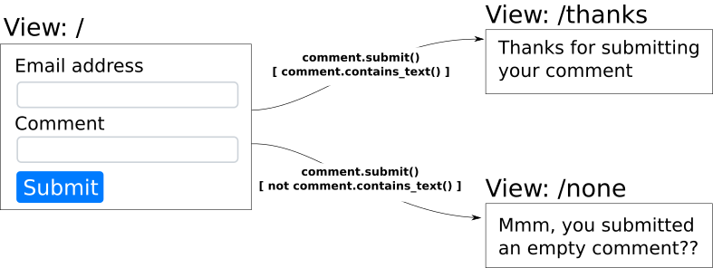

.. Copyright 2013-2016 Reahl Software Services (Pty) Ltd. All rights reserved.

.. |UserInterface| replace:: :class:`~reahl.web.fw.UserInterface`
.. |UrlBoundView| replace:: :class:`~reahl.web.fw.UrlBoundView`
.. |Transition| replace:: :class:`~reahl.web.fw.Transition`
.. |Event| replace:: :class:`~reahl.component.modelinterface.Event`
.. |Action| replace:: :class:`~reahl.component.modelinterface.Action`
.. |Bookmark| replace:: :class:`~reahl.web.fw.Bookmark`
.. |WidgetFactory| replace:: :class:`~reahl.web.fw.WidgetFactory`
.. |Nav| replace:: :class:`~reahl.web.bootstrap.navs.Nav`
.. |Navbar| replace:: :class:`~reahl.web.bootstrap.navbar.Navbar`
.. |define_transition| replace:: :meth:`~reahl.web.fw.UserInterface.define_transition`
   
Moving between Views
====================

.. sidebar:: Examples in this section

   - tutorial.pageflow1
   - features.pageflow

   Get a copy of an example by running:

   .. code-block:: bash

      reahl example <examplename>

The user interface of the address book application can be
split up into two :class:`~reahl.web.fw.View`\ s : one that
lists all the addresses, and another on which you can add a new
address.

.. figure:: addressbooksplit.png
   :align: center
   :alt: A diagram showing two Views, and how one can move between them.

   The address book application with two |UrlBoundView|\s.

Deriving similar looking pages
------------------------------

The simplest way to have many pages look similar is to create a common
page from which you derive pages, each with different extra
content. Add AddressBookPanel to HomePage, and AddressForm to AddAddressPage:

.. literalinclude:: ../../reahl/doc/examples/tutorial/pageflow1/pageflow1.py
   :pyobject: HomePage

.. literalinclude:: ../../reahl/doc/examples/tutorial/pageflow1/pageflow1.py
   :pyobject: AddAddressPage

Bookmarks and Navs
------------------

A |Bookmark| marks a particular |UrlBoundView|.  A |Nav| is a menu
created from a list of |Bookmark|\s. It is a means for the user to
move around in the application.

Create the common AddressBookPage with a |Navbar| just like before, but
add a |Nav| to it:

.. literalinclude:: ../../reahl/doc/examples/tutorial/pageflow1/pageflow1.py
   :pyobject: AddressBookPage

|Bookmark|\s are created for the |UrlBoundView|\s in
`AddressBookUI.assemble`, and passed to the |WidgetFactory| of each
page. The |WidgetFactory| arguments match those of the `__init__`
method of each page.

.. literalinclude:: ../../reahl/doc/examples/tutorial/pageflow1/pageflow1.py
   :pyobject: AddressBookUI

The call to |define_transition| is
changed to take the user back to the home page after adding a new
Address.
	      
AddressBookForm is unchanged in this example. AddressBookPanel though
contains a list of AddressBoxes, but no AddressBookForm. The AddressBookForm
is now on the other |UrlBoundView|.

.. literalinclude:: ../../reahl/doc/examples/tutorial/pageflow1/pageflow1.py
   :pyobject: AddressBookPanel

Guards
======

A guard is an |Action| passed to |define_transition|. If there is more than one
|Transition| for the same |Event|, guards are used to decide on the fly which 
|Transition| to follow. 

The `features.pageflow` example is a simple application that contains guards 
to distinguish between two |Transition|\s: 

After input data is set on the model object, the guard of each applicable
|Transition| is called. The first |Transition| whose guard returns True is 
followed. 

.. literalinclude:: ../../reahl/doc/examples/features/pageflow/pageflow.py
   :pyobject: PageFlowExampleUI

.. literalinclude:: ../../reahl/doc/examples/features/pageflow/pageflow.py
   :pyobject: Comment

