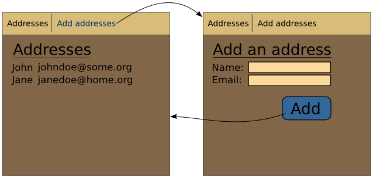

.. Copyright 2013 Reahl Software Services (Pty) Ltd. All rights reserved.
 
Moving between Views
====================

.. sidebar:: Examples in this section

   - tutorial.pageflow1
   - tutorial.pageflow2

   Get a copy of an example by running:

   .. code-block:: bash

      reahl example <examplename>

Most applications consist of several  :class:`~reahl.web.fw.View`\ s  that are designed to work
together. It is useful to have a clear picture of which  :class:`~reahl.web.fw.View`\ s  exist in
a user interface, and how they relate to one another.

For example, the user interface of the address book application can be
split up into two different  :class:`~reahl.web.fw.View`\ s : one that lists all the addresses,
and another on which you can add a new address.

   The address book application with two  :class:`~reahl.web.fw.View`\ s .

In the schematic representation of this idea a :class:`~reahl.web.ui.Menu` has been added to
the application. From the :class:`~reahl.web.ui.Menu`, a user can choose to navigate to the
"Addresses" :class:`~reahl.web.fw.View`, or the "Add Address" :class:`~reahl.web.fw.View`. This is an example of
navigation provided which is under the control of the user.

Also shown in the schematic is that when a user is on the "Add
Address" :class:`~reahl.web.fw.View`, and clicks on the Add button, the user is automatically
transitioned back to the "Addresses" :class:`~reahl.web.fw.View`. In this case, the web
application controls the navigation.

Each of these modes of navigation are dealt with differently:
navigation that is under the control of the user is enabled using
:class:`~reahl.web.fw.Bookmark`\ s to possible target  :class:`~reahl.web.fw.View`\ s . Navigation controlled by the
application in response to user actions is controlled via :class:`~reahl.web.fw.Transition`\ s.

Bookmarks
---------

One of the lower-level web technology concepts which Reahl cannot
abstract away entirely from the programmer is that of an URL. Each
:class:`~reahl.web.fw.View` is defined using a particular URL. After having defined a :class:`~reahl.web.fw.View` though,
a Reahl programmer should stop thinking in terms of URLs, and not use
them further in programming.

Instead, start thinking in terms of :class:`~reahl.web.fw.Bookmark`\ s. A :class:`~reahl.web.fw.Bookmark` is analogous
to the :class:`~reahl.web.fw.Bookmark`\ s which a browser allows its user to save. The concept
of a :class:`~reahl.web.fw.Bookmark` is a means by which to refer to a :class:`~reahl.web.fw.View` elsewhere in an
application. :class:`~reahl.web.fw.Bookmark` is a more abstract concept than that of an URL
and contains a number of other bits of information about the :class:`~reahl.web.fw.View` it
refers to, such as the title of that :class:`~reahl.web.fw.View`, or the access rights of the
current user with regard to the given :class:`~reahl.web.fw.View`. The meta-information in a
:class:`~reahl.web.fw.Bookmark` is useful for :class:`~reahl.web.fw.Widget`\ s that use :class:`~reahl.web.fw.Bookmark`\ s.

So, forget the idea of an URL, and switch over to that of a
:class:`~reahl.web.fw.Bookmark`. :class:`~reahl.web.fw.Bookmark`\ s are much smarter. :class:`~reahl.web.fw.Bookmark`\ s are also the means by
which to define the particular  :class:`~reahl.web.fw.View`\ s  to which a user is allowed to
nagivate directly.

Given that a :class:`~reahl.web.fw.Bookmark` is our way of referring to a :class:`~reahl.web.fw.View`, you should
know that :class:`~reahl.web.fw.Bookmark`\ s can be used to create all sorts of stuff. :class:`~reahl.web.ui.Menu`\ s
can be constructed from :class:`~reahl.web.fw.Bookmark`\ s, for example. A user can then choose
from the :class:`~reahl.web.ui.Menu` which :class:`~reahl.web.fw.View` to go to. A :class:`~reahl.web.fw.Bookmark` contains all the
information necessary for constructing one :class:`~reahl.web.ui.MenuItem` of the :class:`~reahl.web.ui.Menu`.

The example below shows the application designed above with its two
:class:`~reahl.web.fw.View`\ s , and a :class:`~reahl.web.ui.Menu` which is created from :class:`~reahl.web.fw.Bookmark`\ s.  Note how the
:class:`~reahl.web.fw.Bookmark`\ s are obtained: using the :class:`~reahl.web.fw.View` and the :class:`~reahl.web.fw.Region` of which the
:class:`~reahl.web.fw.View` forms part.

The :class:`~reahl.web.ui.Menu` should be on every page. This could be accomplished by adding
a similar :class:`~reahl.web.ui.Menu` to each :class:`~reahl.web.fw.View`. A better solution though, is to create a
main_window :class:`~reahl.web.fw.Widget` for the application, and make this main window
contain the :class:`~reahl.web.ui.Menu`. In the example, AddressBookPage plays this role. A
AddressBookPage is literally just a :class:`~reahl.web.ui.TwoColumnPage`, with an :class:`~reahl.web.ui.HMenu` (a
horisontal menu) added to its `.header`. The :class:`~reahl.web.ui.Menu` uses the textual
description for each :class:`~reahl.web.fw.View` as obtained from the :class:`~reahl.web.fw.Bookmark`\ s from which it
is constructed. Such a description defaults to being the title of the
:class:`~reahl.web.fw.View`.

In order to be able to create the :class:`~reahl.web.ui.HMenu`, AddressBookPage needs a
:class:`~reahl.web.fw.Bookmark` for each :class:`~reahl.web.fw.View` in the application. This information is
available where `.define_main_window()` is called, and so can be
passed in from there as an argument. The arguments passed to
`.define_main_window()` are sent to `AddressBookPage.__init__()` each
time an AddressBookPage is constructed.
 
.. literalinclude:: ../../reahl/doc/examples/tutorial/pageflow1/pageflow1.py

Transitions
-----------

:class:`~reahl.web.fw.Bookmark`\ s form the cornerstone of any navigation which is under the
control of the user. Navigation that happens under the control of the
application has to be programmed explicitly.

The schematic diagram at the beginning of this example is a good way
to visualise the different  :class:`~reahl.web.fw.View`\ s  in the application and how the user
will be *transitioned* between the different  :class:`~reahl.web.fw.View`\ s  in response to user
actions. One of the aims with Reahl is to have code that clearly maps to such a
schematic representation of the application. This is the purpose of
the `.assemble()` method of a :class:`~reahl.web.fw.Region`. In this method, the programmer
first defines each :class:`~reahl.web.fw.View` of the :class:`~reahl.web.fw.Region`, and then defines each possible
:class:`~reahl.web.fw.Transition` between  :class:`~reahl.web.fw.View`\ s . In this example, there is only one :class:`~reahl.web.fw.Transition`:

.. literalinclude:: ../../reahl/doc/examples/tutorial/pageflow2/pageflow2.py
   :pyobject: AddressBookApp

In previous examples an :class:`~reahl.web.fw.EventHandler` was defined before a :class:`~reahl.web.ui.Button` is
placed that needed to trigger an :class:`~reahl.component.modelinterface.Event`. That plan works well for
simple examples -- where a user stays on the same page after an
:class:`~reahl.component.modelinterface.Event`. Where users are moved around in an application, it makes more
sense to show such navigation more explicitly. :class:`~reahl.web.fw.Transition`\ s are special
:class:`~reahl.web.fw.EventHandler`\ s used for this purpose.

Drawing a diagram of how a user can self-nagivate to pages is not very
useful though, because users can jump to many different  :class:`~reahl.web.fw.View`\ s  via
:class:`~reahl.web.fw.Bookmark`\ s on :class:`~reahl.web.ui.Menu`\ s (or even the bookmarks of the browser
itself). Hence usually we would draw the schematic without its :class:`~reahl.web.ui.Menu`,
and only include arrows for :class:`~reahl.web.fw.Transition`\ s between  :class:`~reahl.web.fw.View`\ s . This is the
picture which the code of `.assemble()` tries to make explicit.

Normally, in order to define a transition, one needs to specify the
:class:`~reahl.component.modelinterface.Event` which will trigger it. In our example that :class:`~reahl.component.modelinterface.Event` is not
available, since there is no instance of Address available in the
`.assemble()` method of the :class:`~reahl.web.fw.Region` to ask for its `.events.save`.
For that reason, `.events.save` can also be called on the Address
class itself. The call to `.define_transition` (and its ilk) does
not need the actual event -- it just needs to know how to identify the
:class:`~reahl.component.modelinterface.Event` which serves as its trigger. The `.events` attribute, when
accessed on a class yields this information, but it can only do so for
events that were named explicitly in the call to the `@exposed` decorator.
(This limitation is neccessitated by what is possible in the
underlying implementation of the mechanism.)

The modified final code for our current example is shown below. Note
the following changes as per the explanation above:

 - the call to `.define_event_handler` was removed
 - a new call to `.define_transition` was added (accessing
   `Address.events.save`); and
 - the `@exposed` decorator was changed to explicitly include the
   names of the :class:`~reahl.component.modelinterface.Event`\ s it will define when called

.. literalinclude:: ../../reahl/doc/examples/tutorial/pageflow2/pageflow2.py

Guards
------

:class:`~reahl.web.fw.Transition`\ s between  :class:`~reahl.web.fw.View`\ s  define the "page flow" of a web application.
Such "page flow" is not always simple. Sometimes it is desirable to have
more than one :class:`~reahl.web.fw.Transition` for a particular :class:`~reahl.component.modelinterface.Event`, but have the system choose 
at runtime which one should be followed.

In order to allow such an arrangement, a :class:`~reahl.web.fw.Transition` can be accompanied
by a guard. A guard is an :class:`~reahl.component.modelinterface.Action` which wraps a method which will
always return True or False.  Usually, the framework just picks the
first :class:`~reahl.web.fw.Transition` it can find when needed and follows it. Augmenting
:class:`~reahl.web.fw.Transition`\ s with guards changes this scheme.

When a :class:`~reahl.web.fw.Transition` is found that can be followed, he guard of the
:class:`~reahl.web.fw.Transition` is first executed. That :class:`~reahl.web.fw.Transition` is the only followed if
its guard returns True. If a guard returns False, the search is
continued non-deterministically for the next suitable :class:`~reahl.web.fw.Transition` (with
True guard).

In order to specify a guard for a :class:`~reahl.web.fw.Transition`, pass an :class:`~reahl.component.modelinterface.Action` to the
'guard' keyword argument of `.define_transition()`. (See :doc:`../features/pageflow` for an example.)

