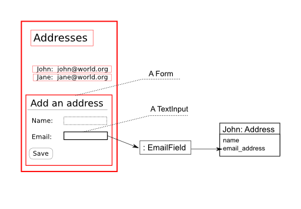

.. Copyright 2014, 2016 Reahl Software Services (Pty) Ltd. All rights reserved.

.. |Widget| replace:: :class:`~reahl.web.fw.Widget`
.. |Input| replace:: :class:`~reahl.web.ui.Input`
.. |Div| replace:: :class:`~reahl.web.bootstrap.ui.Div`
.. |Form| replace:: :class:`~reahl.web.bootstrap.forms.Form`
.. |FormLayout| replace:: :class:`~reahl.web.bootstrap.forms.FormLayout`
.. |InlineFormLayout| replace:: :class:`~reahl.web.bootstrap.forms.InlineFormLayout`
.. |GridFormLayout| replace:: :class:`~reahl.web.bootstrap.forms.GridFormLayout`
.. |FieldSet| replace:: :class:`~reahl.web.bootstrap.forms.FieldSet`
.. |TextInput| replace:: :class:`~reahl.web.bootstrap.forms.TextInput`
.. |Button| replace:: :class:`~reahl.web.bootstrap.forms.Button`
.. |Field| replace:: :class:`~reahl.component.modelinterface.Field`
.. |ExposedNames| replace:: :class:`~reahl.component.modelinterface.ExposedNames`
.. |EmailField| replace:: :class:`~reahl.component.modelinterface.EmailField`
.. |Transition| replace:: :class:`~reahl.web.fw.Transition`
.. |Event| replace:: :class:`~reahl.component.modelinterface.Event`
.. |Action| replace:: :class:`~reahl.component.modelinterface.Action`
.. |UrlBoundView| replace:: :class:`~reahl.web.fw.UrlBoundView`

 
User interaction
================

.. sidebar:: Examples in this section

   - tutorial.addressbook2

   Get a copy of an example by running:

   .. code-block:: bash

      reahl example <examplename>

Forms and Inputs
----------------

|Form|\s get input from users. Build up the |Form| by adding |Input|
|Widget|\s to it (or one of its children), via an appropriate |FormLayout|.

.. sidebar: Other layouts

   Use |InlineFormLayout| or |GridFormLayout| to arrange form inputs 
   differently. You can also compose a form of multiple |Div|\s or 
   |FieldSet|\s and use different layouts on each one.

To group some |TextInput|\s visually, add them to |FieldSet| via a
|FormLayout|. The |FormLayout| arranges the |TextInput|\s with their
associated labels and validation error messages. Call
:meth:`~reahl.web.fw.Widget.add_child` to add the |FieldSet| to the
|Form|.

.. literalinclude:: ../../reahl/doc/examples/tutorial/addressbook2/addressbook2.py
   :pyobject: AddressForm
   :end-before: Button

Fields provide metadata
-----------------------

Each |Input| is wired to an associated |Field|. A |Field|
holds more information about the similarly named attribute of the
Address. |EmailField| constrains the input to be a valid email
address. Invalid input is blocked by the |EmailField| and the
|FormLayout| displays an error message underneath its |TextInput|.

   A rough design sketch

.. _fields_explained:

|Field|\s are defined on Address using a |ExposedNames| namespace:

.. literalinclude:: ../../reahl/doc/examples/tutorial/addressbook2/addressbook2.py
   :pyobject: Address
   :end-before: def save

.. note:: Don't confuse |Field|\s with SQLAlchemy's Columns.

   The email_address |Field| sets the email_address attribute of an
   Address when a |Form| is submitted (and after validating the
   input). A Column on that same email_address takes another
   step---to persist the attribute to the database. They are
   independent and do not *have* to be used together.

   
Buttons and Events
------------------
	      
To save an Address to the database, create a `save()` method on it. Expose
an |Event| for `save()` so that it can be tied to a |Button|.

.. literalinclude:: ../../reahl/doc/examples/tutorial/addressbook2/addressbook2.py
   :pyobject: Address
	      
Add a |Button|, linked to the `save` |Event|. When the |Button| is
clicked, its |Event| occurs, and the |Action| is executed.

.. note:: You don't have to process input data

   Before the |Action| is executed, each |Field| processes its input data
   and sets it on the object the |Field| is bound to.

.. literalinclude:: ../../reahl/doc/examples/tutorial/addressbook2/addressbook2.py
   :pyobject: AddressForm

A |Transition| is defined in `AddressBookUI.assemble` to say that, if
the `save` |Event| occurs on the `home` |UrlBoundView|, the user
should just stay on the `home` |UrlBoundView|.

.. literalinclude:: ../../reahl/doc/examples/tutorial/addressbook2/addressbook2.py
   :pyobject: AddressBookUI

