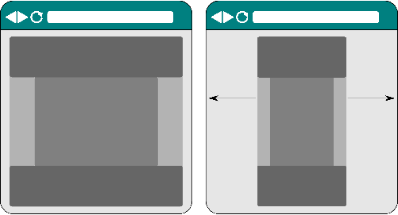
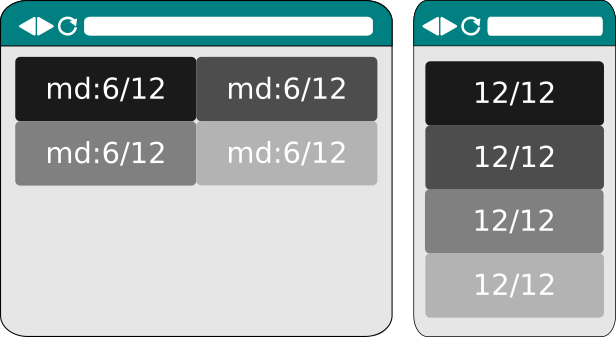

.. Copyright 2016 Reahl Software Services (Pty) Ltd. All rights reserved.

.. |ColumnLayout| replace:: :class:`~reahl.web.bootstrap.grid.ColumnLayout`
.. |ColumnOptions| replace:: :class:`~reahl.web.bootstrap.grid.ColumnOptions`
.. |Div| replace:: :class:`~reahl.web.bootstrap.ui.Div`
.. |HTMLElement| replace:: :class:`~reahl.web.ui.HTMLElement`
.. |HTML5Page| replace:: :class:`~reahl.web.bootstrap.page.HTML5Page`
.. |ResponsiveSize| replace:: :class:`~reahl.web.bootstrap.grid.ResponsiveSize`
.. |Container| replace:: :class:`~reahl.web.bootstrap.grid.Container`
.. |Widget| replace:: :class:`~reahl.web.fw.Widget`
.. |PageLayout| replace:: :class:`~reahl.web.layout.PageLayout`
.. |Nav| replace:: :class:`~reahl.web.bootstrap.navs.Nav`
.. |Navbar| replace:: :class:`~reahl.web.bootstrap.navbar.Navbar`

Layout of pages
===============

.. sidebar:: Examples in this section

   - tutorial.bootstrapgrids

   Get a copy of an example by running:

   .. code-block:: bash

      reahl example <examplename>

Containers
----------

A |Container| manages how the contents of an |HTMLElement| fills the
available width. The contents can be confined to a fixed width (with
margins), or the contents can be fluid and expand to fill the whole
width.

  Fluid vs fixed containers on a site.

Different areas of a page may be laid out using different
|Container|\s. For example, a header and footer area that both stretch
the entire viewport width, with a centered, fixed content area
inbetween.

Responsive layouts
------------------

A responsive layout arranges its contents differently,
depending on the size of the device it is being displayed on.

For example, a |Nav| with many options displays on a cellphone as a
list of options stacked op top of one another. On a large screen, it
spreads the options in one row across the screen.

Use a |ColumnLayout| to control how your layout adapts to different
sizes of device.

A |ColumnLayout| adds a number of visual columns to a |Div|. Add
|Widget|\s into each of the columns to control where they will
display. The width of each column is stated in 1/12ths of the total
width of the containing |Div|. If the total width of all the columns
is more than 12/12ths, the extra columns flow over to a new line.

A |ResponsiveSize| contains all the different sizes to use for a
column on different devices.

  Columns with ResponsiveSize(lg=6) on a large device, defaulting to 12/12ths on a small device.

Add columns by giving a |ColumnOptions| instance for each column when
creating the |ColumnLayout|:

.. literalinclude:: ../../reahl/doc/examples/tutorial/bootstrapgrids/bootstrapgrids.py
   :pyobject: GridBasicsPage.add_four

Columns can also be created after the |ColumnLayout| has been applied:

.. literalinclude:: ../../reahl/doc/examples/tutorial/bootstrapgrids/bootstrapgrids.py
   :pyobject: GridBasicsPage.add_twelve

.. note:: ColumnLayouts need to be nested inside something with a |Container| layout.

Laying out a whole page
-----------------------

A |PageLayout| prepares a page so it has a header area at the
top, a footer at the bottom, and a content area in between.

Use a |PageLayout| in conjunction with with a suitable |ColumnLayout|
to further split the content area into different columns.

.. literalinclude:: ../../reahl/doc/examples/tutorial/bootstrapgrids/bootstrapgrids.py
   :pyobject: PageLayoutPage

