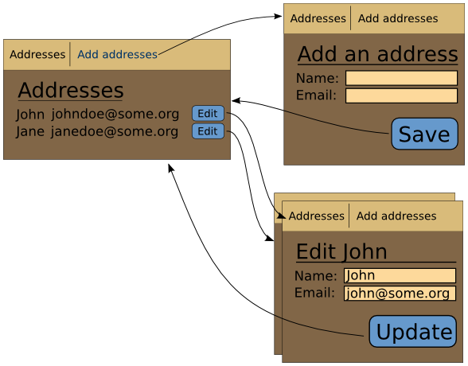

.. Copyright 2013, 2014, 2016 Reahl Software Services (Pty) Ltd. All rights reserved.

.. |View| replace:: :class:`~reahl.web.fw.View`
.. |UserInterface| replace:: :class:`~reahl.web.fw.UserInterface`
.. |UrlBoundView| replace:: :class:`~reahl.web.fw.UrlBoundView`
.. |Bookmark| replace:: :class:`~reahl.web.fw.Bookmark`
.. |A| replace:: :class:`~reahl.web.ui.A`
.. |Field| replace:: :class:`~reahl.component.modelinterface.Field`
.. |Event| replace:: :class:`~reahl.component.modelinterface.Event`
.. |Button| replace:: :class:`~reahl.web.bootstrap.forms.Button`
.. |Form| replace:: :class:`~reahl.web.ui.Form`
.. |Transition| replace:: :class:`~reahl.web.fw.Transition`
.. |Slot| replace:: :class:`~reahl.web.ui.Slot`
.. |assemble| replace:: :meth:`~reahl.web.fw.UserInterface.assemble`
.. |define_view| replace:: :meth:`~reahl.web.fw.UserInterface.define_view`

Parameterised  Views
====================

.. sidebar:: Examples in this section

   - tutorial.parameterised1
   - tutorial.parameterised2

   Get a copy of an example by running:

   .. code-block:: bash

      reahl example <examplename>

The AddressBook example can be changed to allow editing of existing
Addresses.

   Views for editing addresses.

A |View| can have arguments---so that a single "Edit" |View| is
defined *for an as yet unknown Address*.  Computing the actual
contents of the |View| is delayed until the Address argument becomes
available.

How to create a parameterised view
----------------------------------

To specify that a |View| has arguments, create your own class that
inherits from |UrlBoundView|. Give it an
:meth:`~reahl.web.fw.UrlBoundView.assemble` method with keyword
arguments that represent the arguments to the
|UrlBoundView|.

Customise the |View| based on the arguments given inside this
:meth:`~reahl.web.fw.UrlBoundView.assemble` method. The title of the
|UrlBoundView| is set by setting
:attr:`~reahl.web.fw.UrlBoundView.title`. Populate the |Slot|\s by
calling :meth:`~reahl.web.fw.UrlBoundView.set_slot`

.. literalinclude:: ../../reahl/doc/examples/tutorial/parameterised1/parameterised1.py
   :pyobject: EditView

If an EditView is requested for an address_id that does not exist, raise
a :class:`~reahl.web.fw.CannotCreate` to indicate that the
EditView does not exist for the given arguments.

How to define a parameterised view
----------------------------------

To define a parameterised |View|, use the `view_class` keyword
argument to |define_view|.

The framework parses arguments from the URL of the |UrlBoundView| and
passes these into the call to |assemble|.

|Field|\s describe how the framework manages arguments sent to the
|View| via its URL. Each |Field| sent as a keyword argument to
|define_view| is used to compute the value of a matching keyword 
argument in |assemble|.

.. literalinclude:: ../../reahl/doc/examples/tutorial/parameterised1/parameterised1.py
   :pyobject: AddressBookUI

Bookmarks to parameterised Views
--------------------------------

In any Reahl application there are two ways to get to a |UrlBoundView|:

- click on an |A| created from a |Bookmark|
- the application automatically switches to the |UrlBoundView| because of a transition.

Our 'tutorial.parameterised1' example creates an |A| next to each
listed address:

.. literalinclude:: ../../reahl/doc/examples/tutorial/parameterised1/parameterised1.py
   :pyobject: AddressBox

A distinct |Bookmark| is computed for each Address. This is done in
`AddressbookUI.get_edit_bookmark`:

.. literalinclude:: ../../reahl/doc/examples/tutorial/parameterised1/parameterised1.py
   :pyobject: AddressBookUI.get_edit_bookmark

Transitions to parameterised Views
----------------------------------

The 'tutorial.parameterised2' example shows how you would
automatically transition a user to a parameterised view. The example
has an edit |Button| instead of a link placed next to each
Address. First, define a transition that will fire when the "edit"
|Button| gets clicked:

.. literalinclude:: ../../reahl/doc/examples/tutorial/parameterised2/parameterised2.py
   :pyobject: AddressBookUI

A |Button| has to be in a |Form|, so AddressBox must change to be a
|Form|.  Call
:meth:`~reahl.component.modelinterface.Event.with_arguments` on the
|Event| to which the |Button| is tied so that the user will transition
to an EditView matching that specific Address.

.. literalinclude:: ../../reahl/doc/examples/tutorial/parameterised2/parameterised2.py
   :pyobject: AddressBox

