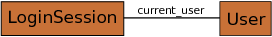

.. Copyright 2013, 2014, 2016 Reahl Software Services (Pty) Ltd. All rights reserved.

.. |DomainException| replace:: :class:`~reahl.component.exceptions.DomainException`
.. |UrlBoundView| replace:: :class:`~reahl.web.fw.UrlBoundView`
.. |UserSession| replace:: :class:`~reahl.webdeclarative.webdeclarative.UserSession`

The web session problem
=======================

.. sidebar:: Examples in this section

   - tutorial.sessionscopebootstrap

   Get a copy of an example by running:

   .. code-block:: bash

      reahl example <examplename>

User sessions
-------------

Objects created during a request to the web browser only exist for the
duration of that request. If you want them to live longer, :doc:`they need
to be persisted in a database <persistence>`.

Sometimes persisted objects are only needed for use in the current
sequence of interactions between a browser and server, after which
they can be safely deleted.

You can persist objects on the server for the duration of a
|UserSession| by making them "session scoped". Session scoped
persisted objects are retained for as long as the |UserSession|
exists.

In the example here we build a simplified version of :doc:`the login
functionality already provided by Reahl<loggingin>` to show how
session scoped objects can be used.

The example consists of User object and a LoginSession object:

   A model for letting Users log in.

The application itself has two pages---a home page on which the
name of the User who is currently logged in is displayed, and a page
on which you can log in using your email address and a
password. 

Declaring the LoginSession
--------------------------

Create a LoginSession persisted class and decorate it using the
:func:`~reahl.sqlalchemysupport.sqlalchemysupport.session_scoped`
decorator.

.. literalinclude:: ../../reahl/doc/examples/tutorial/sessionscopebootstrap/sessionscopebootstrap.py
   :pyobject: LoginSession

The LoginSession keeps track of who is currently logged in through its
`.current_user` relationship to a User.

The `email_address` and `password` are
:class:`~reahl.component.modelinterface.Field`\ s on the LoginSession
-- they are to be linked to Inputs on the user interface.  (The same
goes for the `log_in` :class:`~reahl.component.modelinterface.Event`.)

To complete the model itself, here is the implementation of
User:

.. literalinclude:: ../../reahl/doc/examples/tutorial/sessionscopebootstrap/sessionscopebootstrap.py
   :pyobject: User

Using a session scoped object
-----------------------------

In this example, we obtain the current LoginSession at the beginning
of `.assemble()` of the :class:`~reahl.web.fw.UserInterface`, and send it around as argument to the
login page.

`LoginSession.for_current_session()` will check whether there is a
LoginSession for the current UserSession and create one if
necessary:

.. literalinclude:: ../../reahl/doc/examples/tutorial/sessionscopebootstrap/sessionscopebootstrap.py
   :pyobject: SessionScopeUI

Dealing with DomainExceptions
-----------------------------

A |DomainException| is an exception that can be raised
to communicate a domain-specific error condition to the user.

In this example it may happen that a user supplies an incorrect
password. That's why an InvalidPassword exception is raised inside the
`.log_in()` method of LoginSession.

When the InvalidPassword (a |DomainException|) is raised, the Reahl
framework ignores all :class:`~reahl.web.fw.Transition`\ s defined,
and re-displays the current |UrlBoundView|.  The
:attr:`~reahl.web.ui.Form.exception` will then contain the
|DomainException| that is keeping the user from progressing. Display
this exception using an :class:`~reahl.web.bootstrap.ui.Alert` to
inform the user of the issue:

.. literalinclude:: ../../reahl/doc/examples/tutorial/sessionscopebootstrap/sessionscopebootstrap.py
   :pyobject: LoginForm

The complete example
--------------------

.. literalinclude:: ../../reahl/doc/examples/tutorial/sessionscopebootstrap/sessionscopebootstrap.py

