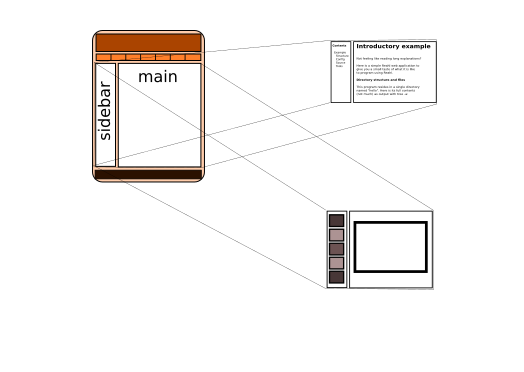

.. Copyright 2014, 2015, 2016 Reahl Software Services (Pty) Ltd. All rights reserved.

.. |UserInterface| replace:: :class:`~reahl.web.fw.UserInterface` 
.. |View| replace:: :class:`~reahl.web.fw.View`
.. |UrlBoundView| replace:: :class:`~reahl.web.fw.UrlBoundView`
.. |Slot| replace:: :class:`~reahl.web.ui.Slot`
.. |PageLayout| replace:: :class:`~reahl.web.bootstrap.grid.PageLayout`

Reusing a single page for a whole UserInterface
===============================================

.. sidebar:: Examples in this section

   - tutorial.slots

   Get a copy of an example by running:

   .. code-block:: bash

      reahl example <examplename>

A page with varying contents
----------------------------

:doc:`Up to now <connectingviews>` all the pages of an application
were made to look similar by deriving each page from a common
superclass.

There is an easier way.

An |UrlBoundView| can plug different contents into the same page
provided that that page contains placeholders, called |Slot|\s. Each
|Slot| on a page is referred to by name.

   A page with two different views.

Below is an example application with two |UrlBoundView|\s that re-use the
same page. The home page looks as follows:

   .. figure:: ../_build/screenshots/slots1.png
      :align: center

"Page 2", looks the same, but with different text in the |Slot|\s:

   .. figure:: ../_build/screenshots/slots2.png
      :align: center

Create a page with Slots
------------------------

MyCustomPage calls :meth:`~reahl.web.layout.PageLayout.with_slots` to
let the |PageLayout| create a |Slot| inside each added column:

.. literalinclude:: ../../reahl/doc/examples/tutorial/slots/slots.py
   :pyobject: MyCustomPage

Define views in terms of Slots
------------------------------

MyCustomPage is defined as a single |UserInterface|\-wide page with the
call to :meth:`~reahl.web.fw.UserInterface.define_page`.  Call
:meth:`~reahl.web.fw.ViewFactory.set_slot` to define how each
|UrlBoundView| populates the placeholders.

The arguments expected by the __init__ of MyPage are passed along in
the call to :meth:`~reahl.web.fw.UserInterface.define_page`.

.. literalinclude:: ../../reahl/doc/examples/tutorial/slots/slots.py
   :pyobject: SlotsUI

