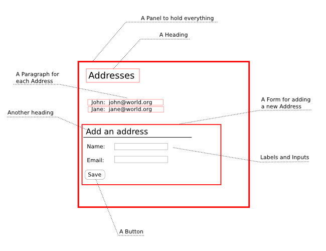

.. Copyright 2012, 2013 Reahl Software Services (Pty) Ltd. All rights reserved.
 
User interface basics
=====================

.. sidebar:: Examples in this section

   - tutorial.addressbook1
   - tutorial.addressbook2

   Get a copy of an example by running:

   .. code-block:: bash

      reahl example <examplename>

Let's recap what you should understand by now:

 - You should know what a very basic user interface for a web
   application looks like, as described in the skeleton application in
   :doc:`gettingstarted`.

 - You should understand that application because the details of how
   it is put together is explained in :doc:`buildingblocks`.

 - Useful applications cannot only have a user interface, they'd have
   a user interface precisely as a means for users to interact with an
   underlying model.  As explained in :doc:`models`, Reahl models are
   augmented to make writing Reahl user interfaces easy.

The next step is to understand how the adornments added to the model
are used by user interface code.

Start with a plan
-----------------

Let's stick a user interface onto the model developed in
:doc:`models`.

The easiest plan would be to give the application one single :class:`~reahl.web.fw.View`, its
home page '/'.  On this :class:`~reahl.web.fw.View` can be a list of all the Addresses in the
database, followed by a means to add a new Address to the list.

It helps to draw a rough diagram of this idea:

   A schematic plan of the :class:`~reahl.web.fw.View`.

Note in the diagram above that blocks are drawn around certain areas,
and annotated. These are the main :class:`~reahl.web.fw.Widget`\ s one would need for such an
application.

Designing a user interface in Reahl basically means deciding which
:class:`~reahl.web.fw.Widget`\ s it would consist of, and how they relate to each other and the
model.

A skeleton built from Widgets
-----------------------------

Given the schematic planning above, it is easy to create a skeleton of
the planned user interface. Just create a :class:`~reahl.web.fw.Widget` for each of the
marked areas:

.. literalinclude:: ../../reahl/doc/examples/tutorial/addressbook1/addressbook1.py

To have a ":class:`~reahl.web.ui.Panel` to hold everything",
AddressBookPanel is created and added to the "main" column of the page
used for the single :class:`~reahl.web.fw.View`, defined on '/'.
Similarly, AddAddressForm is created in the skeleton and AddressBox to
represent the form and each Address shown, respectively.  According to
the plan above then, an AddressBookPanel should consist of a heading,
followed by an AddressBox for each Address in the database, followed
by an AddAddressForm.

You can clearly see in the implementation of AddressBookPanel that
this is exactly what happens. Each AddressBox is actually implemented
as a :class:`~reahl.web.ui.Panel` with a paragraph (:class:`~reahl.web.ui.P`\ ) inside of it that in turn contains
some text representing a given Address.

The AddAddressForm is where more work is needed, but some preparations
have been made for that already: An :class:`~reahl.web.ui.InputGroup` is a :class:`~reahl.web.fw.Widget` that groups
together a number of Inputs, and gives them a nice heading. Such an
:class:`~reahl.web.ui.InputGroup` is added to the AddAddressForm so long. (The actual Inputs
and :class:`~reahl.web.ui.Button` are still missing.)

At this point you can actually run the application already (even
though it won't do much).

Fleshing out the skeleton 
-------------------------

The skeleton was built first so you can get comfortable with
structuring an application using :class:`~reahl.web.fw.Widget`\ s. That's not really the
interesting part though.  The interesting part is letting the user
interact with the model, and that is quite simple, actually:

The model at work here was set up so that an Address exposes two
:class:`~reahl.component.modelinterface.Field`\ s for user input or output: `name` and `email_address`. Basic
Inputs in Reahl are all constructed with (at least) the :class:`~reahl.web.ui.Form` of which
they form part, and the :class:`~reahl.component.modelinterface.Field` they should be attached to.

Hence, to allow a user to input or output something to/from the model,
you just create an :class:`~reahl.web.ui.Input` :class:`~reahl.web.fw.Widget`, specifying which :class:`~reahl.component.modelinterface.Field` it should be
attached to (in this example, a :class:`~reahl.web.ui.TextInput` each time). The same idea
goes for :class:`~reahl.component.modelinterface.Event`\ s -- :class:`~reahl.web.ui.Button` Inputs are linked to :class:`~reahl.component.modelinterface.Event`\ s on the model:

.. literalinclude:: ../../reahl/doc/examples/tutorial/addressbook2/addressbook2.py
   :pyobject: AddAddressForm

The updated code above creates a :class:`~reahl.web.ui.TextInput` for each one of the :class:`~reahl.component.modelinterface.Field`\ s
of the given Address.

A :class:`~reahl.web.ui.TextInput` is just a simple box into which you can type.  A
:class:`~reahl.web.ui.LabelledBlockInput` is a :class:`~reahl.web.fw.Widget` that wraps around another :class:`~reahl.web.ui.Input` (such
as a :class:`~reahl.web.ui.TextInput`), and provides it with a label. Successive
:class:`~reahl.web.ui.LabelledBlockInput`\ s will arrange themselves neatly below each other.

It is not necessary to say what should go into each label though,
because that information can be gleaned from each :class:`~reahl.component.modelinterface.Field` already.  The
other information carried by the :class:`~reahl.component.modelinterface.Field`\ s is also very useful.  Check
out the example in :doc:`../features/validation` again for a fuller
explanation of how such :class:`~reahl.component.modelinterface.Field`\ s would make Inputs behave when a user
attempts to supply invalid input.

A :class:`~reahl.web.ui.Button` works pretty much the same as Inputs. Instead of accepting a
:class:`~reahl.component.modelinterface.Field` as argument upon creation though, a :class:`~reahl.web.ui.Button` takes an :class:`~reahl.component.modelinterface.Event`. This
:class:`~reahl.component.modelinterface.Event` will be triggered when a user clicks on that :class:`~reahl.web.ui.Button`. 

When an :class:`~reahl.component.modelinterface.Event` is received, a few things happen: first the input typed
by a user is set on the model objects (as governed by the
:class:`~reahl.component.modelinterface.Field`\ s). Then, the `action` of that :class:`~reahl.component.modelinterface.Event` is executed. Lastly, the
user is shown a new :class:`~reahl.web.fw.View`.

An :class:`~reahl.web.fw.EventHandler` specifies which :class:`~reahl.web.fw.View` should be shown to the user in
response to an :class:`~reahl.component.modelinterface.Event`. In this example the :class:`~reahl.web.fw.EventHandler` does not
specify a new :class:`~reahl.web.fw.View` to go to, so the user will just be shown the same
:class:`~reahl.web.fw.View` again (the default). Defining the :class:`~reahl.web.fw.EventHandler` is necessary
though, else that :class:`~reahl.component.modelinterface.Event` is not allowed to happen at all.

Try it out
----------

With all of the above example code and explanations, you should be
able to cobble together your own address book example. Go ahead and do
that so you can play with the live example.

Remember the following gotchas:

 - Your project needs a `.reahlproject` file in its root.
 - Run ``reahl setup -- develop -N`` each time you update
   the `.reahlproject` file
 - Use `reahl-control` to create the database and the database tables
   before you run your application. 
 - For now, drop your old database and recreate a new one if you
   changed anything related to its schema.
 - All persisted classes need to be added to the `.reahlproject` file.
 - If you have more than one version of a project, put them in
   directories of which the names differ! Reahl assumes that your
   component is named for the directory in which it resides.

